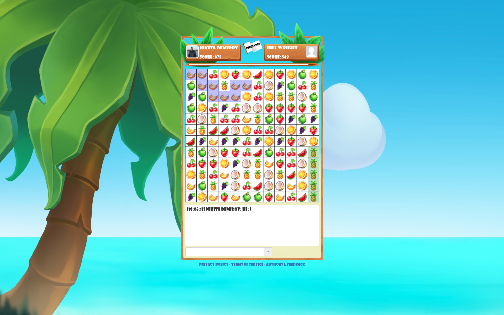

# Fruit's Bounty



## Description

Fruits' Bounty - is the prototype of multiplayer game server.

The architecture is designed:
  * To quickly process players game actions (the priority business case).
  Their priority is higher than other requests (e.g., auth requests).
  To games do not "hang" when there are many authentication requests at the same time.
  * With using non-blocking multithreading.
  To enable vertical scale and increase of threads.


There is a weak reference between Game-Server and the Game due to the project is divided into three modules:
fruit-bounty-server, fruit-bounty-game-api and fruit-bounty-game.

All game logic is "protected" in the game module. And game-module implements game-api-module.
The server redirects incoming game actions to the game controller through the code API (Java code).
Answers from the game come either immediately or postponed - via a subscription (the Subscriber template).

The game module does not know anything about who will call it through the java API and subscribe to events.
To better understand the interaction between the server and the game, a separate module is allocated - the gaming API is a set of contracts (interfaces).
The server calls only them. The game-module provides an implementation.


**There are both unit and integration tests.**

In general, tests are used where there are difficult/long/tedious test cases.

For example, it may be different tests for disconnections: let's say if the user has connected from a new device, then the old connection needs to be closed. Or for example there is a disconnection check if a user was inactive for 15 minutes (to not wait so long - many parameters are extracted into environment variables and mocked for a few milliseconds to speed up such cases in tests).

Also there is a chat check that different users see each other's messages.
There are tests for game requests and game creation.

Integration tests are well suited for the above cases (Spring Boot Tests). They up server and IoC context (with mocked external systems). 

Unit tests are also used. For example, where there is no need to up the context; or where you need to check many variations of input parameters.

For example, unit tests are used for test covering of game rules. Each game rule is implemented by a separate class with a single public method. It is a pure function and easily covered by test.

And then - business logic is composed in a separate class from these rule-functions. So it's much easier to read and understand the code.

In general, for each task are using appropriate tools.

Also there is a **cache** between а database and the service layer.

During the authentication the user data is read into the cache (if it has not yet been in the cache). After that, all the rare requests for this data come from the cache. After the end of the game (which happens not often) - the data is updated in cache and DB.
Consequently, the processing of game actions does not slow down due to DB calls.

Please, don't see the client code :) It's small and just a rapid prototype with minimal functionality.

More details here (on russian): https://habrahabr.ru/post/351738/

## Technologies

Key Technologies: Java SE, Concurrency, Spring Framework.

Other technologies: Spring WebSocket, Spring Boot Test, JPA, PostgreSQL; client - HTML 5 Canvas.

## How to play online

- On `Facebook`: [https://apps.facebook.com/fruit-bounty](https://apps.facebook.com/fruit-bounty) (desktop only)
- On `vk.com`: [https://vk.com/app5154054](https://vk.com/app5154054) (mobile & desktop)
- On `Yandex`: [https://yandex.ru/games/play/178103?draft=true](https://yandex.ru/games/play/178103?draft=true) (no auth necessary)

Or you can search the game in `vk.com` app catalog by key-words like *Fruit's Bounty*.

## How to run locally

1. Set database environment variables (in `application.yml` or by using your IDE): 
- `JDBC_DATABASE_URL`
- `JDBC_DATABASE_USERNAME`
- `JDBC_DATABASE_PASS`

2. Set `Facebook` environment variables. It's needed only for `Facebook` social network requests.
You can skip this step or set dummy/random values if you don't log in via `Facebook`:
- `FACEBOOK_APP_ID` (E.g. `554726609114367` - my dev test appId)

3. Set `vk.com` (`VK`) environment variables. It's needed only for `vk.com` social network requests.
You can skip this step or set dummy/random values if you don't log in via `vk.com`:
- `VK_APP_ID`
- `VK_ACCESS_TOKEN`
- `VK_SECRET_KEY`

4. Run Spring Boot application. And open the game:
- on [http://localhost:5000/fb-app](http://localhost:5000/fb-app) for `Facebook`;
- or open [http://localhost:5000/vk-app?viewer_id=_vk_user_id_&auth_key=_auth_key_](http://localhost:5000/vk-app?viewer_id=_vk_user_id_&auth_key=_auth_key_) for `vk.com`
(you can find `auth_key` in your real `vk` game in `vk` iframe).

You can change the port by set `PORT` environment variable or edit it in `application.yml` file.
By default, the port is `5000`.

Note: you can use Docker to run local PosgreSQL instance:
1. Pull image [https://hub.docker.com/_/postgres/](https://hub.docker.com/_/postgres/)
2. Run docker container, e.g.: ```docker run --name h-postgres -e POSTGRES_PASSWORD=postgres -p:5432:5432 -d postgres:9.6.4```
3. Specify environment variable, e.g.:
   1. `JDBC_DATABASE_URL` = `jdbc:postgresql://192.168.99.100:5432/postgres`
   2. `JDBC_DATABASE_USERNAME` = `postgres`
   3. `JDBC_DATABASE_PASS` = `postgres`

Note: to use Docker on Windows 7 you can setup 'Docker Toolbox' soft. Which will start on specific IP which is shown on startup in a console.

## License
Fruit's Bounty is Open Source software released under the
[Apache 2.0 license](http://www.apache.org/licenses/LICENSE-2.0.html)

Design and images: Irina Pichugina, Elena Pichugina.
Contacts: https://vk.com/i.pichugina99, https://vk.com/id382496812

Developer is Nikita Demidov.

Fonts 'Showcard Gothic' and 'Showcard Gothic Cyrillic':
Copyright: Copyright (c) 1997, 1998 The Font Bureau, Inc. and Jim Parkinson. All rights reserved.
Trademark: Copyright (c) 1985, 1987, 1988, 1989 The Font Bureau, Inc. All rights reserved. Showcard Gothic is a trademark of The Font Bureau, Inc.

## Feedback
Please, write your suggestions, feedback and bugs to the Fruit's Bounty Support:
FruitsBounty@gmail.com

## Dates
It was written in ~Oct 2017 ~ Jan 2018.
